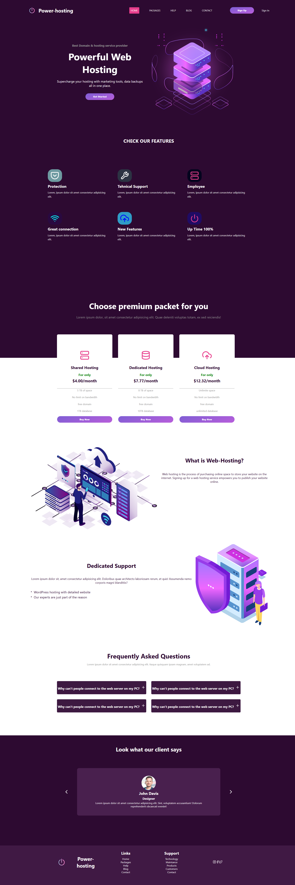

# 🌐 Web Hosting Landing Page

A modern and responsive landing page for a web hosting company. Designed to showcase hosting features, pricing plans, and a call-to-action to attract potential customers.


## 📸 Screenshot



---

## 🛠️ Built With

- **HTML** – semantic structure
- **CSS** – layout using Flexbox and Grid
- **React** – all interactivity
- **Responsive Design** – optimized for mobile, tablet, and desktop
 

---

## 💡 Features

- ✅ Hero section with a clear call to action
- ✅ Feature highlights for hosting services
- ✅ Testimonials
- ✅ Sign up /Sign in form
- ✅ Pricing table for different plans
- ✅ Clean, professional UI layout
- ✅ Fully responsive design

---

## 📁 Folder Structure

```plaintext
webhosting/
|-- App.css
|-- App.js
|-- App.test.js
|-- assets
|-- components
|   |-- Bloglist.jsx
|   |-- Bloglogic.jsx
|   |-- Faq.jsx
|   |-- Footer.css
|   |-- Footer.jsx
|   |-- NavBar.css
|   |-- NavBar.jsx
|   |-- ScrollVisibility.jsx
|   `-- Slide.jsx
|-- index.css
|-- index.js
|-- logo.svg
|-- pages
|   |-- Blog.css
|   |-- Blog.jsx
|   |-- Contact.css
|   |-- Contact.jsx
|   |-- Help.css
|   |-- Help.jsx
|   |-- Home.jsx
|   |-- Packages.css
|   |-- Packages.jsx
|   |-- SignIn.css
|   |-- SignIn.jsx
|   |-- SignUp.css
|   |-- SignUp.jsx
|   `-- home.css

